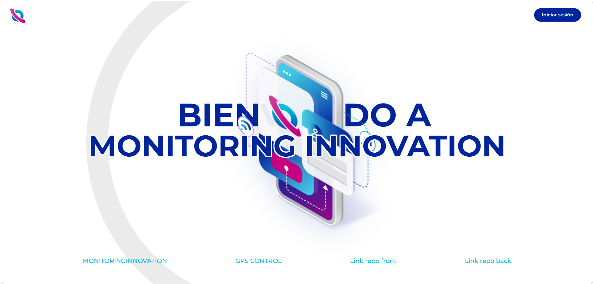
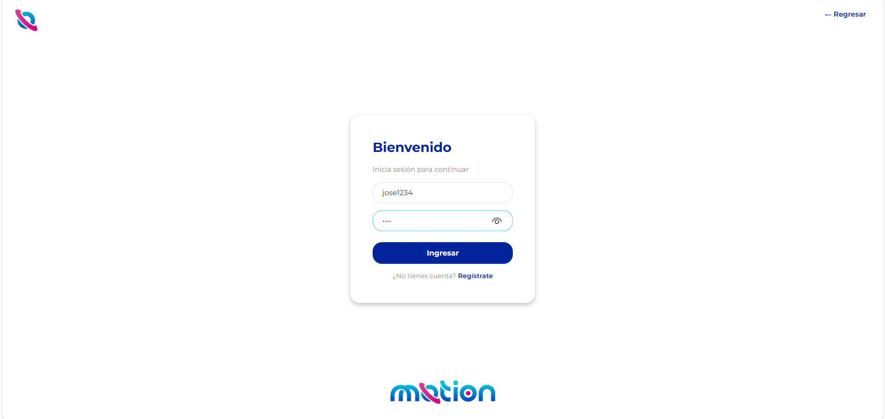
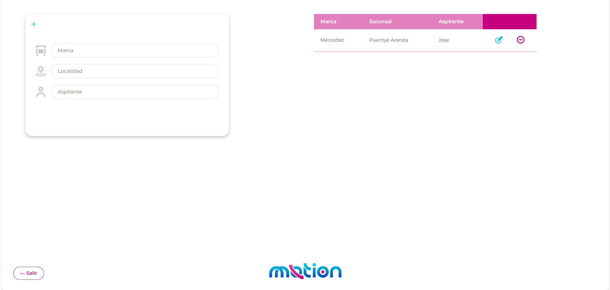
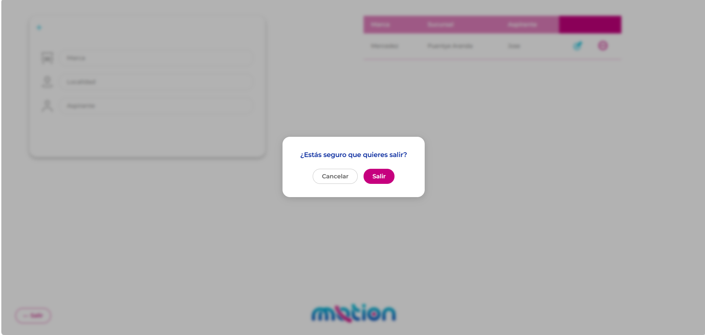

# 🚗 Concesionario Frontend — Vehicle Management Dashboard

React dashboard for vehicle fleet management, built as a technical assessment for AB Comercial SAS (Motion/GPS Control), a Colombian fleet monitoring company.

**Live App:** [josedevoc.github.io/concesionario-frontend](https://josedevoc.github.io/concesionario-frontend) &nbsp;|&nbsp; **Backend:** [concesionario-backend repo](https://github.com/Josedevoc/concesionario-backend)

> ⚠️ The backend runs on Render free tier — may take ~30s to wake up. Visit [this link](https://concesionario-backend-fastapi.onrender.com/) first to activate it before using the app.

---

## 🛠️ Tech Stack

| Layer | Technology |
|---|---|
| Framework | React 19 + Vite |
| Routing | React Router DOM (HashRouter for GitHub Pages) |
| Animations | Framer Motion |
| HTTP Client | Axios + JWT interceptor |
| Styling | CSS Modules + Montserrat font |
| Deploy | GitHub Pages |

---

## ✨ Features

- **Animated Home** — curved line, half-moon shape, and smooth entrance animations
- **JWT Auth** — login and register with token-based protected routes
- **Vehicle Dashboard** — full CRUD with animated table (Framer Motion)
- **Form animations** — typewriter effect on edit/delete, particle effect on create
- **Pink icons** activate when the `+` form button is clicked
- **Responsive design** based on Figma mockup with corporate color palette
- Deployed via `gh-pages` — no server required

---

## 🎨 Design

| Token | Value |
|-------|-------|
| Blue1 | `#00249C` |
| Blue2 | `#40CEE4` |
| Grey1 | `#C5C5C5` |
| Red1 (accent) | `#C6007E` |
| Font | Montserrat |

---
## 📸 Screenshots






---

## 📁 Project Structure

```
src/
├── assets/                     # Icons and images (normal + pink variants)
├── components/
│   ├── CurvedLine.jsx           # Home animated SVG line
│   ├── VehicleForm.jsx          # CRUD form with animations
│   └── VehicleTable.jsx         # Table with Framer Motion
├── pages/
│   ├── Home.jsx                 # Landing with animations
│   ├── Login.jsx                # Login + register with JWT
│   └── Dashboard.jsx            # Protected vehicle dashboard
├── services/
│   └── api.js                   # Axios instance + JWT interceptor
├── styles/
│   ├── variables.css            # Design tokens
│   ├── Dashboard.css
│   ├── Home.css
│   └── Login.css
├── App.jsx                      # Routes + PrivateRoute guard
└── main.jsx
```

---

## 🚀 Local Setup

```bash
# 1. Clone the repo
git clone https://github.com/Josedevoc/concesionario-frontend
cd concesionario-frontend

# 2. Install dependencies
npm install

# 3. Configure environment variables
# Create .env in root:
VITE_API_URL=https://concesionario-backend-fastapi.onrender.com

# 4. Run dev server
npm run dev
```

App available at `http://localhost:5173`

---

## 🌐 Deploy (GitHub Pages)

```bash
npm run deploy
```

> After renaming the repo, update `vite.config.js`:
> ```js
> base: '/concesionario-frontend/'
> ```

---

## 🔗 Related

- **Backend repo:** [concesionario-backend](https://github.com/Josedevoc/concesionario-backend)
- **Backend live:** [concesionario-backend-fastapi.onrender.com](https://concesionario-backend-fastapi.onrender.com)

---

## 👤 Author

**Jose Santiago Jimenez Carranza** — Systems & Computer Engineer  
[GitHub](https://github.com/Josedevoc) · [LinkedIn](https://linkedin.com/in/tu-perfil)
